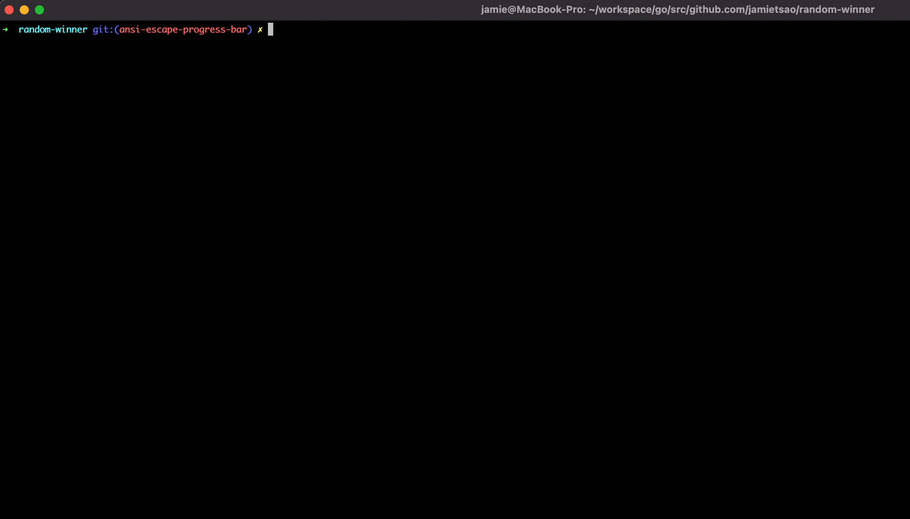

# random-winner
After receiving a $100 gift card to DoorDash for taking a sales call with a software vendor, I wanted to give it to someone random on the team.  As a manager that rarely gets to write code these days, I decided to write a quick program to select the winner 🤓.

Table of Contents
=================
* [Latest Version - 1/26/21](#latest-version---12621)
* [Instructions for use](#instructions-for-use)
* [Original Version (run on 8/4/20)](#original-version-run-on-8420)

## Latest Version - 1/26/21
After reading this wonderful [post](https://www.lihaoyi.com/post/BuildyourownCommandLinewithANSIescapecodes.html) about [ANSI escape codes](https://en.wikipedia.org/wiki/ANSI_escape_code), this silly program I wrote a few months back was the perfect opportunity to dabble with them.  So instead of immediately displaying the final results with an anti-climatic drumroll (see original version below), I used ANSI escape codes to simulate a dramatic race to the finish line.

Here was the original version from 8/4/20:


Here's the latest version using ANSI escape codes (and of course emojis):



## Instructions for use
1. Download script:
    - If you have Go installed: `go get github.com/jamietsao/random-winner`
    - Else download the binary directly: https://github.com/jamietsao/random-winner/releases
5. Run script:

`random-winner -names=Steph,Klay,Draymond,Iggy,Bogut`

***

## Original Version (run on 8/4/20)
### Drumroll, please ... 🥁🥁🥁🥁
This was the result:
```
➜  random go run main.go

     Benny => 1250893
   Brandon => 1249641
      Andy => 1250759
      Eric => 1248545
   Leilani => 1250984
      Jeff => 1248989
      Bigo => 1251376
    Carmen => 1248813

The winner is .......
🥁
🥁
🥁
🥁
🥁
🥁

BIGO!!
```

Congrats, Bigo!
